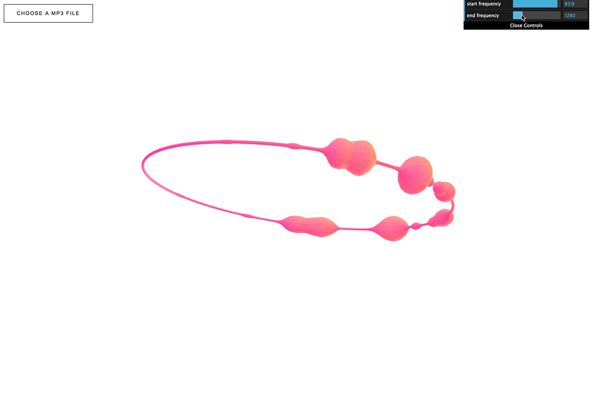
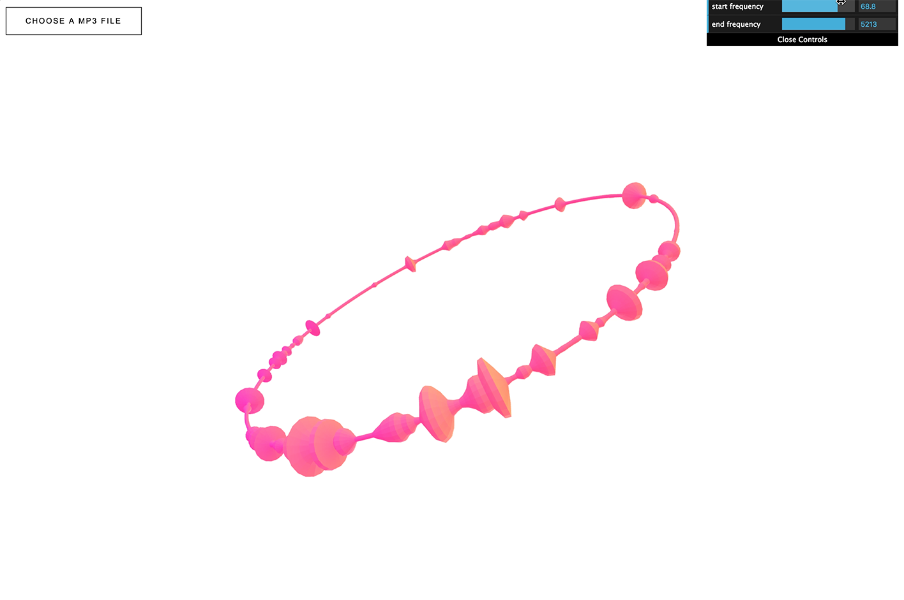

# audio-visualizer-torus

## Description
The demo of audio visualizer using cubic spline interpolation.  

* [demo](https://mnmxmx.github.io/audio-visualizer-torus/dst/)  
* about [cubic spline interpolation](http://www.paulinternet.nl/?page=bicubic)  
[](./screenshot2.png) 
[](./screenshot2.png) 

## Usage  
* Clone repository  
* Install Node.js  
* Run following commands  
```
  npm install  
  npm start  
```

## How to play the music  
* Open your local file from the upper left button "CHOOSE A MP3 FILE".


